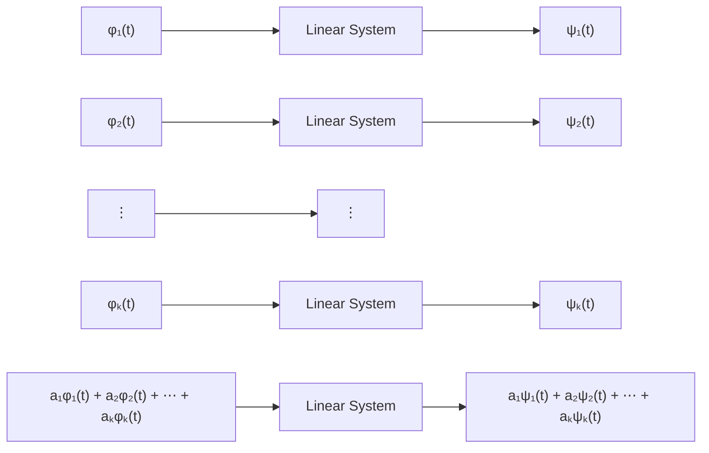

# Linear System
A linear system has the property that the response to a linear combination of inputs is the same linear combination of the individual responses.

if 

```mermaid
graph LR

  %% Individual inputs and outputs through the same linear system
  phi1["φ₁(t)"] --> LS1["Linear System"] --> psi1["ψ₁(t)"]
  phi2["φ₂(t)"] --> LS2["Linear System"] --> psi2["ψ₂(t)"]
  dots1["⋮"] --> dots2["⋮"]
  phik["φₖ(t)"] --> LSk["Linear System"] --> psik["ψₖ(t)"]

  %% Linear combination case
  linCombo["a₁φ₁(t) + a₂φ₂(t) + ⋯ + aₖφₖ(t)"] --> LScombo["Linear System"] --> comboOut["a₁ψ₁(t) + a₂ψ₂(t) + ⋯ + aₖψₖ(t)"]

```
